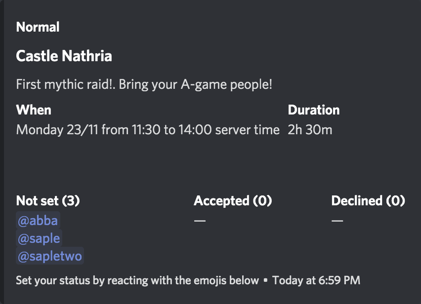

# Ironmon

A discord bot for managing guild events. Created originally for my World of Warcraft guild to manage our signups for raids.

## Development

```bash
npm i
npm run dev
```

## Setting up the bot

### Bot config

For the bot to work you need to setup `.env` file. File called `.env.example` contains example of the `.env` file you need to have. Copy it and rename it then to `.env`. Then change the values to your own ones.

| Key            | Description                                            | Example value                                     |
| -------------- | ------------------------------------------------------ | ------------------------------------------------- |
| BOT_AUTH_TOKEN | The secret bot authorization token issued by Discord\* | s6EefggqESBAF65fs2g1iaZlQyI6NQv7FgecxAcTUyVtYjTaD |
| ADMINS         | Discord IDs of admin users\*\*                         | 123456789012345678                                |

\* You can get the secret authorization by following this guide [Create a Discord bot under 15 minutes](https://thomlom.dev/create-a-discord-bot-under-15-minutes/). Getting the token start at "Get that token"-step.  
\*\* Find out how to get your Discord ID from the [official documentation](https://support.discordapp.com/hc/en-us/articles/206346498-Where-can-I-find-my-User-Server-Message-ID-).

### Reaction emojis

For [`!add-event`](#add-event---create-a-new-event-post) to work you need to have custom emojis named `:accepted:` and `:declined:`. These will be used for the reaction buttons under event posts.


_Discord custom emojis needed for `!add-event` to work_

Here are basic emojis you can use:

- [assets/accepted.png](assets/accepted.png)
- [assets/declined.png](assets/declined.png)

Alternatively, you can use any existing emoji you have added. If they have different name change the reaction name to be used for the buttons in `config.ts` under `addEventReactions`.

## Commands

### `!add-event` - Create a new event post

#### Example

```ts
!add-event --title "Castle Nathria" --desc "First mythic raid!. Bring your A-game people!" --start "2020-11-23 12:30:00+02:00" --duration "2h 30m" --type "Normal"
```

Creates a event post like this



#### Options

| Parameter  | Format/type              | Required | Description                                                                                                                                                                                                                                            |
| ---------- | ------------------------ | -------- | ------------------------------------------------------------------------------------------------------------------------------------------------------------------------------------------------------------------------------------------------------ |
| `title`    | `String`                 | yes      | Headline shown in the event message                                                                                                                                                                                                                    |
| `desc`     | `String`                 | no       | Description of the event                                                                                                                                                                                                                               |
| `start`    | `Date` in ISO8601 format | yes      | Start date and time of the event                                                                                                                                                                                                                       |
| `duration` | `Xh | Ym | Xh Ym`        | yes      | Duration of the event in hours and/or minutes. For example `2h 30m`, `4h` or `45m`                                                                                                                                                                     |
| `type`     | `String`                 | no       | Event type, shown above the title. Can be used e.g. for showing raid level. If set to "normal", "heroic" or "mythic" the event post will have different accent color to more easily distinguish between different level of raids. Defaults to `"Raid"` |
| `debug`    | `Boolean`                | no       | If set to true bot will not delete the post that triggered new event to be created. Defaults to `false`                                                                                                                                                |

### Signups reporting

By default when user signs-up for an event or changes their status the bot will post message to `#attendance-log` channel.

Report channel can be changed in `config.ts` by changing the name of the channel in `signups.reportChannel`.

Reporting can be turned off completely by setting `signups.report` to `false` in `config.ts`
